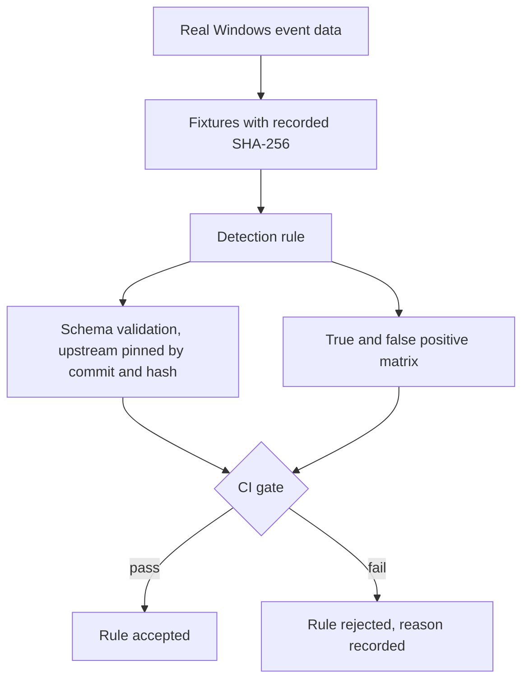

# windows-detection-engineering-lab

Sigma detection rules for Windows, validated against publicly licensed EVTX samples and
against declared test fixtures, in CI.

[](https://github.com/marcuspaula-seceng/windows-detection-engineering-lab/actions/workflows/validate.yml)

---

## What this is

A detection-engineering lab built around one idea:

> **A detection rule defines both what it catches and what it lets through.
> Only the first half usually gets written down.**

Every rule here ships with the evidence it was built from, the fixtures that exercise it, and
an explicit statement of what it does *not* detect.

## What this is not

```text
Not production detections.       Not tuned against any organisation's baseline.
Not an incident response record. No real telemetry from any employer or client.
Not vendor-converted.            Rules have not been executed on a real SIEM backend.
```

---

## Contents

```text
sigma/     detection rules, written from scratch
tools/     a small Sigma evaluator, an EVTX field-mapper, and schema validation
tests/     fixtures with the expected verdict declared per rule, plus ground truth
samples/   provenance and fetch instructions for the public EVTX used (files not committed)
docs/      licensing analysis
```

---

## Two rules, two telemetry sources

The same behaviour — a scheduled task registered to run as SYSTEM and come back
persistently — is visible in two different places, and neither view is complete.

| | `marcus_schtasks_system_persistence` | `marcus_scheduled_task_system_audit` |
|---|---|---|
| Logsource | `process_creation` | `windows` / `security` |
| Sees | **how** the task was created | **that** the task was created |
| Evidence | `schtasks.exe /create /ru SYSTEM /sc minute` | `<UserId>S-1-5-18</UserId>` + `<Interval>PT1M</Interval>` in `TaskContent` |
| Blind to | task created via `Register-ScheduledTask` or the Task Scheduler API | tasks named to masquerade under `\Microsoft\` |

```text
PROCESS TELEMETRY  +  AUDIT EVENT  =  coverage neither one has alone
```

That is the point of the second rule. It is not a better version of the first — it closes a
specific hole that no amount of tuning on the first rule can reach, because the evidence
simply is not in `process_creation`.

### Both are honestly rated

`status: experimental`, `level: medium`. Each was validated against **one** real event and a
fixture set. That does not justify `stable`, and it does not justify `high` in an environment
where configuration management legitimately registers SYSTEM tasks with boot triggers.

---

## Validation

Four independent gates, all in CI. They are deliberately not the same thing:

```text
1. project rule policy      stricter than the spec -- e.g. falsepositives must not be empty
2. official Sigma JSON      SigmaHQ/sigma-specification schema, vendored with provenance
   Schema
3. pySigma parse            the official parser must accept the rules            BLOCKING
   sigma check              SigmaHQ repository conventions                    REPORT ONLY
4. fixture behaviour        every rule behaves exactly as declared, per fixture
```

`sigma check` is report-only on purpose. It enforces the conventions of the **SigmaHQ
repository** — filename patterns, title style, tag ordering. This repository is not that
repository. Its findings are printed in full and never suppressed; they just do not fail a
build for style rules that do not apply here.

```text
YAML valid       !=  Sigma valid
Sigma valid      !=  detection works
fixtures pass    !=  real-world detection proven
```

### Against real data

Public EVTX samples (CC0) are normalised from Event IDs 4688 and 4698 and evaluated:

```text
9 real events from 3 public samples   (8x 4688, 1x 4698)

rule 1  matches  schtasks.exe /create /sc minute /mo 1 /tn eviltask
                             /tr C:\tools\shell.cmd /ru SYSTEM
rule 2  matches  the 4698 audit event for that same task

0 false positives
```

The most useful negative is `cscript.exe` running a `.vbs` silently as SYSTEM — an event that
looks malicious at a glance and is in fact the Microsoft Monitoring Agent doing its job.
Neither rule fires on it.

### Against fixtures

15 fixtures, each declaring its expected verdict **per rule** and a `_malicious` ground truth,
so the score is measured rather than asserted:

```text
rule 1   within its own telemetry (9 of 15)     TP=4  TN=4  FP=0  FN=1
rule 2   within its own telemetry (6 of 15)     TP=2  TN=3  FP=0  FN=1

combined coverage, per behaviour rather than per event:
  6 malicious behaviours, 5 detected
  7 benign behaviours,    0 alerts
```

Scoring each rule only within its own telemetry is deliberate. A `process_creation` rule does
not *fail* to catch a 4698 event — it never sees it. Counting that as a false negative would
make the metric meaningless.

### The two remaining false negatives, both declared

| Behaviour | Missed by | Why |
|---|---|---|
| `Register-ScheduledTask` via API | rule 1 | no `schtasks.exe` process is ever created |
| task named `\Microsoft\Windows\...\Updater` | rule 2 | the `\Microsoft\` filter excludes it |

The first is **closed** by rule 2. The second is the price of the filter that removes
Windows' own tasks, and it is a real weakness: an attacker who names a task to sit under
`\Microsoft\` evades it. Documented here rather than discovered later.

---

## Prior art

`SigmaHQ` has an existing rule for Event 4698, `Suspicious Scheduled Task Creation`
(`3a734d25-df5c-4b99-8034-af1ddb5883a4`, Nasreddine Bencherchali). It was read and compared
**after** the rule here was written. It was not copied, adapted, or used as a base.

It approaches the same event on a different axis: it looks at **what the task runs** —
suspicious paths and interpreters inside `TaskContent`. The rule here looks at **who it runs
as and how often it returns**.

Evaluated against the real CC0 sample event, the SigmaHQ rule does **not** match: its
`selection_commands` block hits, but `selection_paths` does not, because the task action is
`C:\tools\shell.cmd` and `C:\tools\` is not in its path list. Both blocks are required.

That is not a criticism of a good, widely deployed rule — it is the reason orthogonal
detections are worth writing. Running both would cover more than running either.

---

## Reproducing the results

```bash
pip install -r requirements.txt
python tools/validate_schema.py    # official Sigma JSON Schema
python tools/run_tests.py          # fixture matrix -- this is what CI runs
```

Against the real samples, on Windows:

```powershell
# see samples/README.md for provenance, hashes and how to fetch them
.\tools\Export-EvtxToJson.ps1 -Path .\samples -OutFile .\tools\events-normalized.json
python tools\sigma_eval.py sigma\marcus_scheduled_task_system_audit.yml tools\events-normalized.json
```

`Export-EvtxToJson.ps1` uses only `Get-WinEvent`, which ships with Windows. Nothing is
installed, nothing is imported into the system event log, and no audit policy is changed.

---

## Design notes

**`tools/sigma_eval.py` is a deliberate subset, not a pySigma replacement.** It supports
`contains`, `contains|all`, `startswith`, `endswith`, exact match, list-as-OR, and the
`all of x_*` / `1 of x_*` condition forms. It **refuses a rule** that uses anything else,
rather than silently returning a wrong verdict. A validator that quietly ignores what it does
not understand is worse than no validator — it issues a false pass. The authoritative parser
is pySigma, in CI; this one exists so the fixtures can run anywhere.

**The field mapping is where the bugs live.** In EVTX 4688, `ProcessId` is the *creating*
process, not the created one. It maps to Sigma's `ParentProcessId`. Mapping it to `ProcessId`
inverts the whole process tree and nothing warns you.

**The same Event ID does not mean the same fields.** Across the three public samples used here,
4688 appears with 15 fields on one host and 9 on another — the older schema has no
`ParentProcessName` at all. A rule written against `ParentImage` silently fails to fire on
those hosts. That is measured, not assumed: 6 of the 9 events have no parent field.

**`TaskContent` gets its own length limit.** It is the full task XML and runs past 1,600
characters; truncating it at the normal limit would destroy the detection while every test
still passed. It is configuration XML rather than payload text, so the reason for the general
truncation does not apply to it.

**YAML has types JSON does not.** `date: 2026-09-07` unquoted parses as a `datetime.date`, and
schema validation rejected two perfectly valid rules until the validator converted it. The
rules were never wrong; the harness was. Worth knowing before trusting a green check.

---

## Limitations

- Nine real events. That is not a fleet, and it cannot establish a real false-positive rate.
- No organisational baseline. How noisy these rules are depends entirely on how much SYSTEM
  automation an environment runs — which is exactly what `falsepositives` says.
- **Rule 2 depends on audit policy.** Event 4698 requires *Audit Other Object Access Events*.
  Where it is not enabled, no 4698 is written, and **absence of the event does not prove no
  task was created**. The rule is silent, not clean.
- Rules are parsed by pySigma in CI but not converted to a backend query and not executed on a
  real SIEM. The evaluator used for fixtures is mine, and a tool agreeing with itself is not
  independent validation.
- Validated against Event IDs 4688 and 4698 only — not against Sysmon.
- The sample telemetry comes from the dataset author's lab (`OFFSEC` domain). Some events in
  it are collection artefacts rather than attack activity; `samples/README.md` says which.

---

## Licence

**Not yet chosen.** See `docs/LICENSING.md`. Until a licence file exists, default copyright
applies and no reuse rights are granted.

---

## Author

Marcus Paula — Security & Infrastructure Engineer · Dublin, Ireland


## Architecture



## Testing and validation

| Layer | What it checks |
|---|---|
| Schema validation | Rule structure against the official upstream JSON schema, pinned by commit and hash |
| Positive fixtures | Malicious behaviours the rule must detect |
| Negative fixtures | Benign behaviours that must not raise an alert |
| CI | Toolchain pinned to a resolved version, run on every push |

Source data is public-domain with recorded SHA-256 and documented provenance.

## Lessons learned

A field truncation at four hundred characters, in a field of over sixteen hundred, left the
entire suite green while the rule silently never fired. Separately, a validator rejected two
rules when the defect was in the validator itself, not in the artefacts under test.

Both produced a standing rule here: **verify what is doing the testing before changing what is
being tested**, and treat a green suite as a claim rather than a result.

Event schemas were also observed to differ between hosts, with the same event carrying a
different field count. Rules that depend on a field absent from some hosts fail silently on
those hosts.

## Limitations

This is a laboratory. Rules have not been deployed to a production SIEM, and no production
telemetry was used. Detection coverage is demonstrative, not exhaustive.
